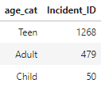

# project-three
## Interactive Visualization Project
-------------------------------------------------------------------------------

## Project Title:
    K-12 School Shooting Incidents: 1970-2022
-------------------------------------------------------------------------------

## Team Members:
* Emily Shewcraft
* Daniel Meyerowitz
* Louis Ferrante
* Callie Carlton
* Dianna Rivera

-------------------------------------------------------------------------------

## Project Description/Outline
### Data Collection and Analyses
1. Imported data found in Kaggle
2. Cleaned and prepared data (ETL) in Jupyter Notebook
3. Compared variables to address research questions
4. Stored data in Mongo database
5. Utilized Python Flask API to tie data to local host
6. Incorporated HTML/CSS code to build base site structure
7. Created interactive map using JavaScript

### Presentation and Summarization 
4. Created and presented a formal visual presentation, including interactive visual elements
5. Drafted written analysis of the data
6. Summarized conclusions

-------------------------------------------------------------------------------

## Research Questions
1. To what degree over time have school shooting incidents increased since 1970?
2. How does the level of education (high, middle, elementary) affect the incident rate?
3. Does the population of the area affect incident rates?
4. What is the most common type of weapon utilized in these incidents?
5. Are the majority of these incidents targeted or randon shootings?
6. Does the age of the shooter impact the incident rate? What about age of the victims?
7. What is the most common outcome for the shooter? What about for the victims?

-------------------------------------------------------------------------------

## Datasets
US School Shootings (1970-2022)
(https://www.kaggle.com/datasets/shilongzhuang/us-school-shootings-19702022)

K-12 School Shooting Database
(https://k12ssdb.org/)

Slidedeck
(https://docs.google.com/presentation/d/1k8OorVZBVGKdkF2QtxJUzcMwhjrGBCUKHqja74yz8Vg/edit#slide=id.p)

-------------------------------------------------------------------------------

## Task Delineation
* Emily - research, project proposal, clean WEAPONS CSV, dataset manipulation, Javascript layering, presentation
* Callie - research, project proposal, clean VICTIM CSV, MongoDB/Flask, HTML/CSS/Javascript, presentation
* Daniel - research, project proposal, clean SHOOTER CSV, dataset manipulation, data analysis, silde creation, presentation
* Louis - research, project proposal, dataset manipulation, data analysis, slide creation, presentation
* Dianna - research, project proposal, clean INCIDENT CSV

-------------------------------------------------------------------------------

## Repository Table of Contents
* "Datasets" folder containing the original CSV files
* "Images" folder containing screen captures of visualization and analysis
* "Clean Data" folder containing ETL/analysis Jupyter Notebook files and cleaned CSVs
* "Mongo-Flask" folder containing Mongo Jupyter Notebook and Flask Python files
* "static" folder containing CSS and JavaScript code for visualization
* "index" file containing HTML code for visualization 

-------------------------------------------------------------------------------

## Analysis

**To what degree over time have school shooting incidents increased since 1970?**
* School shooting incidents have dramatically increased since 1950-especially within the past 5-10 years.

**How does the level of education (high, middle, elementary) affect the incident rate?**
* School shooting incidents occur most commonly at the high school level, with elementary (2nd highest) trailing by over 700 incidents.

**Does the population of the area affect incident rates?**
* The data definitely appears to cluster around large cities (Los Angeles, Chicago, etc.)-the top 3 states were CA, TX, and FL.

**What is the most common type of weapon utilized in these incidents?**
* Handguns are the most common weapon used by far-this is most likely because they are the most common weapon kept in U.S. households.

**Are the majority of these incidents targeted or randon shootings?**
* The number of incidents with specific intended targets far exceeds the amount that were categorized as random, etc.

**Does the age of the shooter (left) impact the incident rate? What about age of the victims (right)?**
* Shooters: Most of the shooters in this dataset fell into the "Teen" category (13-20 years old).
* Victims: Most of the victims in this dataset also fell into the "Teen" category (13-20 years old).
* Adults (21+ years old) constituted the second largest category in both datasets.

**What is the most common outcome for the shooter (left)? What about for the victims (right)?**
* Shooters: The shooters in this dataset survived the incident by a large margin.
* Victims: The majority of the victims sustained non-fatal wounds in the incidents.
* When compared to shooters, three times as many victims sustained fatal injuries as a result of the incidents.

-------------------------------------------------------------------------------

### Conclusion

Possible drawbacks-the COVID-19 pandemic may show skewed data due to lower in-person attendance rates 

-------------------------------------------------------------------------------
